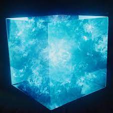

<!-- Improved compatibility of back to top link: See: https://github.com/othneildrew/Best-README-Template/pull/73 -->

<!--
*** Thanks for checking out the Best-README-Template. If you have a suggestion
*** that would make this better, please fork the repo and create a pull request
*** or simply open an issue with the tag "enhancement".
*** Don't forget to give the project a star!
*** Thanks again! Now go create something AMAZING! :D
-->

<!-- PROJECT SHIELDS -->
<!--
*** I'm using markdown "reference style" links for readability.
*** Reference links are enclosed in brackets [ ] instead of parentheses ( ).
*** See the bottom of this document for the declaration of the reference variables
*** for contributors-url, forks-url, etc. This is an optional, concise syntax you may use.
*** https://www.markdownguide.org/basic-syntax/#reference-style-links
-->

<!-- PROJECT LOGO -->
 

  

  <h3 align="center">ML02 Task for CO2 Detection</h3>

  

    A novel solution to estimate CO2 concentration from satellite data.
     
    <a href="https://ocov2.jpl.nasa.gov/"><strong>Explore the dataset »</strong></a>
     
     
    
  

<!-- TABLE OF CONTENTS -->

  
Table of Contents

  <ol>
    <li>
      <a href="#about-the-project">About The Project</a>
    </li>
    <li>
      <a href="#getting-started">Getting Started</a>
    </li>
    <li><a href="#usage">Usage</a></li>
    <li><a href="#roadmap">Roadmap</a></li>
    <li><a href="#contact">Contact</a></li>
    <li><a href="#acknowledgments">Acknowledgments</a></li>
  </ol>

<!-- ABOUT THE PROJECT -->
## About The Project

Here we propose a novel method to to accurately predict the presence of CO2 bins across the Earth, given the data from the OCO-2 and GOSAT-TANSO-FTS2 level 2 satellite data. We train a machine learning model based on the extracted features. This model works particularly well as it is an ensemble between the following approaches:

* K - nearest neighbour Regressor
* Support Vector Regressor
* Random Forest Regressor
* Adaboost Regressor

Use the `README.md` to get started.

(<a href="#readme-top">back to top</a>)

<!-- GETTING STARTED -->
## Getting Started

This step by step explanation provides a better insight into the working of our approach.

### Understanding the dataset

We make use of the Level 2 processed data obtained from the OCO-2 and GOSAT-TANSO-FTS2 satellites. We use a combined of about 900 data points each day for a week, in order to train the model. The OCO-2 satellite has a revisit period of 16 days with 227 repeated orbits. Whereas the GOSAT has a revisit period of 3 days with 44 repeated orbits. The information is present in the form of numerical data, and is cleaned up with regards to the missing parameters.

### Feature Extraction

Here we mention all the relevant features used for training and predicting:

1. Latitude 
2. Longitiude
3. Time
4. Solar Zenith Angle
5. Sensor Zenith Angle
6. XCO2 Uncertainty
7. XCO2 Apriori
8. Pressure levels along with their corresponding pressure weights
9. CO2 profile apriori

(<a href="#readme-top">back to top</a>)

<!-- USAGE EXAMPLES -->
## Usage

The model is trained on the data from the OCO-2 and GOSAT satellites. The OCO-2 covers a larger region of about 16km whereas GOSAT covers a smaller region of 7km. Hence the trained model is used to accurately predict the CO2 values from the data from the GOSAT satellite. 

The model is trained on all the above mentioned features and learns according to the ground truth of XCO2 values from the GOSAT data.

_For more examples, please refer to the [Documentation](https://example.com)_

(<a href="#readme-top">back to top</a>)

<!-- ROADMAP -->
## Roadmap

- [x] Download satellite data
- [x] Cleanup the missing data
- [x] Feature extraction
- [x] Neural Network based approach
- [x] Building the ensemble based model
    - [x] Train the model 
    - [x] Test the model

See the [open issues](https://github.com/othneildrew/Best-README-Template/issues) for a full list of proposed features (and known issues).

(<a href="#readme-top">back to top</a>)

<!-- CONTACT -->
## Contact

Palgun N P - my0504palsore@gmail.com

Harish Gumnur  - hari.8jan@gmail.com

Nikhil P Reddy - nikhil2002s@gmail.com

Project Link: [https://github.com/harry7337/TRINIT_594092-UQ66S02N_ML](https://github.com/harry7337/TRINIT_594092-UQ66S02N_ML)

(<a href="#readme-top">back to top</a>)

<!-- ACKNOWLEDGMENTS -->
## Acknowledgments

Use this space to list resources you find helpful and would like to give credit to. I've included a few of my favorites to kick things off!

* [Choose an Open Source License](https://choosealicense.com)
* [GitHub Emoji Cheat Sheet](https://www.webpagefx.com/tools/emoji-cheat-sheet)
* [Malven's Flexbox Cheatsheet](https://flexbox.malven.co/)
* [Malven's Grid Cheatsheet](https://grid.malven.co/)
* [Img Shields](https://shields.io)
* [GitHub Pages](https://pages.github.com)
* [Font Awesome](https://fontawesome.com)
* [React Icons](https://react-icons.github.io/react-icons/search)

(<a href="#readme-top">back to top</a>)

<!-- MARKDOWN LINKS & IMAGES -->
<!-- https://www.markdownguide.org/basic-syntax/#reference-style-links -->
[contributors-shield]: https://img.shields.io/github/contributors/othneildrew/Best-README-Template.svg?style=for-the-badge
[contributors-url]: https://github.com/othneildrew/Best-README-Template/graphs/contributors
[forks-shield]: https://img.shields.io/github/forks/othneildrew/Best-README-Template.svg?style=for-the-badge
[forks-url]: https://github.com/othneildrew/Best-README-Template/network/members
[stars-shield]: https://img.shields.io/github/stars/othneildrew/Best-README-Template.svg?style=for-the-badge
[stars-url]: https://github.com/othneildrew/Best-README-Template/stargazers
[issues-shield]: https://img.shields.io/github/issues/othneildrew/Best-README-Template.svg?style=for-the-badge
[issues-url]: https://github.com/othneildrew/Best-README-Template/issues
[license-shield]: https://img.shields.io/github/license/othneildrew/Best-README-Template.svg?style=for-the-badge
[license-url]: https://github.com/othneildrew/Best-README-Template/blob/master/LICENSE.txt
[linkedin-shield]: https://img.shields.io/badge/-LinkedIn-black.svg?style=for-the-badge&logo=linkedin&colorB=555
[linkedin-url]: https://linkedin.com/in/othneildrew
[product-screenshot]: images/screenshot.png
[Next.js]: https://img.shields.io/badge/next.js-000000?style=for-the-badge&logo=nextdotjs&logoColor=white
[Next-url]: https://nextjs.org/
[React.js]: https://img.shields.io/badge/React-20232A?style=for-the-badge&logo=react&logoColor=61DAFB
[React-url]: https://reactjs.org/
[Vue.js]: https://img.shields.io/badge/Vue.js-35495E?style=for-the-badge&logo=vuedotjs&logoColor=4FC08D
[Vue-url]: https://vuejs.org/
[Angular.io]: https://img.shields.io/badge/Angular-DD0031?style=for-the-badge&logo=angular&logoColor=white
[Angular-url]: https://angular.io/
[Svelte.dev]: https://img.shields.io/badge/Svelte-4A4A55?style=for-the-badge&logo=svelte&logoColor=FF3E00
[Svelte-url]: https://svelte.dev/
[Laravel.com]: https://img.shields.io/badge/Laravel-FF2D20?style=for-the-badge&logo=laravel&logoColor=white
[Laravel-url]: https://laravel.com
[Bootstrap.com]: https://img.shields.io/badge/Bootstrap-563D7C?style=for-the-badge&logo=bootstrap&logoColor=white
[Bootstrap-url]: https://getbootstrap.com
[JQuery.com]: https://img.shields.io/badge/jQuery-0769AD?style=for-the-badge&logo=jquery&logoColor=white
[JQuery-url]: https://jquery.com 
